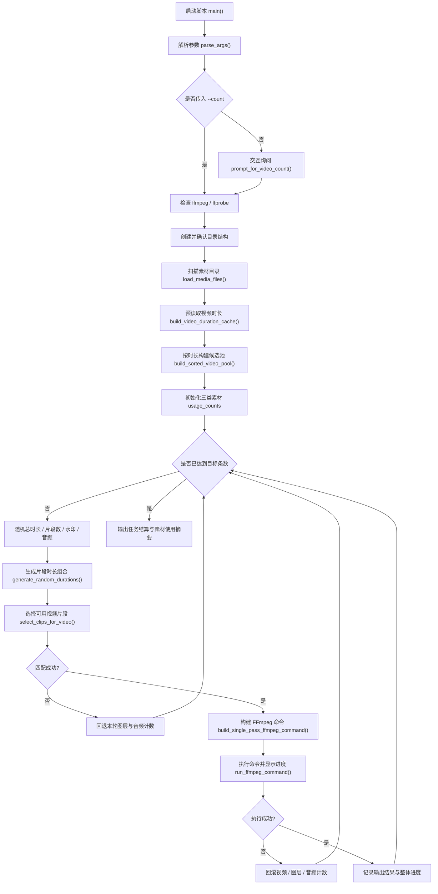

# 🧠 Video Splicer 开发说明文档

> **面向开发者的实现说明、架构梳理与迭代记录**
>
> 当前对应脚本：`video_splicer.py`  
> 当前文档基线：**v9.5 Premium Terminal Edition**

## 📌 文档定位

这份文档不是给脚本使用者看的操作手册，而是给开发者、维护者和后续迭代者看的。

如果你只是想知道“怎么放素材、怎么运行、生成的视频会输出到哪里”，请直接看 `README.md`。  
如果你关心的是：

- 这个脚本为什么这样设计
- 当前版本到底优化了什么
- 核心流程由哪些函数组成
- 后续继续迭代时应该从哪里下手

那么这份文档才是你真正需要的版本。

---

## 🎯 项目目标

`video_splicer.py` 的目标很明确：

**以尽量低的使用门槛、较少的中间文件、清晰的终端反馈，批量生成带水印和背景音乐的竖屏随机拼接视频。**

它不是完整的视频编辑器，也不追求复杂时间线能力。  
它解决的是一种更朴素、也更常见的问题：

> 手里已经有一批视频素材、若干 PNG 图层和一些背景音乐，想快速、连续、尽量稳定地批量出片。

所以整个脚本的设计取向，一直都围绕下面四件事展开：

1. **能批量跑**
2. **能稳定跑**
3. **能看清进度**
4. **尽量减少多余的落盘与中间环节**

---

## 🏗️ 当前版本概览

当前版本相比更早期的“能跑就行”思路，已经逐渐收敛成一套比较稳定的终端批处理工具。

### 当前版本的关键特征

- 输出目录固定为 `output_videos/`
- 按运行时间戳为每轮任务生成唯一前缀
- 启动时一次性缓存所有视频时长
- 每条成片随机选择总时长与片段数
- 每个片段从满足时长条件的素材中均衡选择
- 水印与音频也采用均衡调度
- 单条视频通过一次 FFmpeg 命令直接输出成片
- FFmpeg 原始日志被压缩为更安静、可解析的进度流
- 终端界面以“总览 / 当前任务 / 结果 / 结算”四层结构呈现
- 单次尝试失败不会直接结束整轮任务，而是自动回滚并重试

从工程视角看，这个脚本已经不再只是“一个 Python 调 FFmpeg 的小实验”，而是一套有明确交互节奏和容错策略的小型批处理工作流。

---

## 🗺️ 架构流程图

如果只用一句话描述当前脚本的整体架构，可以理解为：

> **参数输入层 + 素材扫描层 + 随机调度层 + FFmpeg 执行层 + 终端反馈层**

下面这张图展示的是当前版本从启动到结算的完整路径：



### 这张图最想表达的三个重点

1. 当前脚本不是线性“一次执行完就结束”，而是围绕一个带重试能力的批量循环构建。
2. “匹配失败”和“执行失败”是两种不同失败路径，处理方式也不同。
3. 终端展示并不是装饰层，而是整个脚本体验的一部分，贯穿在任务执行全过程中。

---

## 🧭 设计原则

### 1. 交互优先，但不放弃命令行参数

脚本默认支持两种启动模式：

- 直接执行 `python3 video_splicer.py`
- 显式传入 `--count` / `--min-clips` / `--max-clips`

这背后的设计思路是：

- 日常人工运行时，交互输入更顺手
- 批量调用或脚本化运行时，命令行参数更稳定

因此当前版本采取了“**交互优先 + 参数兼容**”的折中策略：

- 没传 `--count` 时，先问用户这次生成多少条
- 传了 `--count` 时，直接跳过询问

### 2. 少做重复探测

视频时长读取属于高频且重复的信息，如果每轮匹配都调用一次 `ffprobe`，会产生明显的额外开销。

因此脚本在启动阶段就调用：

- `build_video_duration_cache()`
- `build_sorted_video_pool()`

先把所有视频时长读出来，再构建按时长排序的候选池，后续重复利用。

### 3. 少做无意义中间文件

这个项目早期很容易滑向一种“切片一个文件、拼接一个文件、再叠水印、再混音、最后导出”的串行流水线。

那种方案当然能跑，但问题也很明显：

- 中间文件多
- 磁盘 I/O 大
- 清理麻烦
- 批量任务时容易让目录变得很脏

当前版本改为：

**把裁切、缩放、补边、拼接、水印叠加、音频混入尽量合并到一次 FFmpeg 输出中完成。**

这也是当前实现最重要的工程取舍之一。

### 4. 出错时继续向前，而不是轻易整轮中断

批量任务里，最让人难受的不是“单次失败”，而是“跑到一半整轮停掉”。

因此脚本的策略不是追求每次随机组合都一次成功，而是：

- 单次失败可接受
- 自动回滚计数
- 继续生成下一轮随机组合
- 只在超过最大尝试次数时才真正结束

这让脚本更像一个长期可用的小工具，而不是脆弱的一次性脚本。

---

## 🧩 核心目录与数据约定

脚本以自身所在目录作为根目录，约定如下：

```text
工程文件/
├── video_splicer.py
├── README.md
├── 说明文档.md
├── source_videos/
├── source_layers/
├── source_audios/
└── output_videos/
```

对应常量如下：

```python
BASE_DIR = Path(__file__).resolve().parent
SOURCE_DIR = BASE_DIR / "source_videos"
OUTPUT_DIR = BASE_DIR / "output_videos"
SOURCE_LAYERS_DIR = BASE_DIR / "source_layers"
SOURCE_AUDIOS_DIR = BASE_DIR / "source_audios"
```

### 当前素材格式约束

- 视频：`.mp4`、`.mov`
- 水印：`.png`
- 音频：`.aac`

这里有一个值得注意的现实约束：

**音频目录当前默认只读取 `.aac`。**

也就是说，如果维护者后续打算扩展兼容性，最自然的切入点之一就是让 `source_audios/` 同时支持 `.mp3`、`.m4a` 等更常见格式。

---

## 🔄 整体执行流程

从 `main()` 进入后，当前版本的执行顺序大致如下：

### 阶段 1：启动与参数校验

- `parse_args()`
- `prompt_for_video_count()`
- `check_required_tools()`

这一层负责：

- 读取命令行参数
- 校验 `count / min-clips / max-clips`
- 在未传 `--count` 时进行交互输入
- 检查 `ffmpeg` 和 `ffprobe` 是否可用

### 阶段 2：目录与素材池初始化

- 自动创建素材与输出目录
- `load_media_files()` 读取各类素材文件
- 对素材数量做基础合法性校验

当前限制尤其体现在这里：

- 视频素材数量必须至少达到 `max-clips`
- 否则无法保证单条视频中“不重复选源视频”的约束

### 阶段 3：视频时长预读取

- `build_video_duration_cache()`
- `build_sorted_video_pool()`

这一步会过滤掉无法读取时长的异常素材，并建立一个按视频时长排序的候选池，为后续高效筛选提供基础。

### 阶段 4：循环生成每条成片

每一轮尝试会做以下事情：

1. 随机选择总时长
2. 随机选择片段数
3. 选择本轮水印与音频
4. 生成各片段目标时长
5. 匹配足够长的视频素材
6. 构建 FFmpeg 命令
7. 执行单次成片输出
8. 成功则记录结果，失败则回滚使用计数

### 阶段 5：任务结算

如果达到目标数量，则输出：

- 成功总数
- 总尝试次数
- 累计耗时
- 输出目录
- 各类素材使用摘要

如果达到最大尝试次数仍未完成，也会输出失败结算和后续建议。

---

## 🧪 随机策略与素材调度

当前版本的“随机”不是纯无约束随机，而是带有一定约束和均衡逻辑的。

### 1. 视频总时长随机

候选时长：

```python
POSSIBLE_DURATIONS = [17, 18, 19, 20]
```

这意味着每条视频的总时长会落在一个比较窄的区间内，目的是：

- 保持成片长度稳定
- 控制输出节奏相对一致
- 避免出现极短或极长的异常成片

### 2. 片段数量随机

默认范围：

```python
DEFAULT_MIN_CLIPS_PER_VIDEO = 6
DEFAULT_MAX_CLIPS_PER_VIDEO = 9
```

这一设定会影响视频节奏密度，也直接影响素材池压力：

- 片段数越高，说明单条视频需要更多不同源素材
- 片段数越高，随机匹配失败概率也会提升

### 3. 片段时长随机切分

函数：

```python
generate_random_durations(total_duration, num_segments, min_duration)
```

逻辑思路是：

- 先为每个片段保底 `min_duration`
- 再把剩余时长随机打散
- 最终洗牌，得到一组总和固定、单段长度不完全相同的片段时长

这比简单平均切分更自然，也更符合“随机拼接”的目标。

### 4. 素材均衡使用

当前版本对三类素材都维护了使用次数：

- 视频素材：`video_usage_counts`
- 水印素材：`layer_usage_counts`
- 音频素材：`audio_usage_counts`

其中：

- 水印和音频通过 `choose_balanced_item()` 实现“少用优先”
- 视频素材则在满足时长条件的候选中，优先选择当前使用次数最少的文件

这比纯 `random.choice()` 更适合批量任务，因为它能显著降低“总是重复用同几个素材”的情况。

---

## ⚙️ FFmpeg 管线设计

当前版本最核心的技术实现，在于：

> **单条视频尽量通过一次 FFmpeg 命令直接输出成片。**

对应函数：

```python
build_single_pass_ffmpeg_command(...)
```

### 这条命令做了什么

对每个视频片段：

- 使用 `-ss` 指定随机起点
- 使用 `-t` 指定截取时长
- 作为独立输入送进 FFmpeg

随后通过 `filter_complex` 完成：

1. `scale`
2. `pad`
3. `setsar`
4. `fps`
5. `concat`
6. `overlay`

最后再：

- `map` 视频输出
- `map` 音频输入
- 使用 `h264_videotoolbox` 编码视频
- 使用 `aac` 编码音频
- 用 `-shortest` 对齐最终时长

### 关键收益

- 不需要先导出每一段临时切片
- 不需要单独再做一次拼接中间文件
- 不需要最后再做一次额外叠图
- 批量运行时目录更干净

### 当前管线的边界

虽然这是“单次输出成片”，但它并不是完整 NLE 引擎。

当前还不支持的方向包括：

- 转场系统
- 多轨音频混音
- 关键帧级别参数变化
- 字幕轨自动生成
- 复杂滤镜模板切换

所以这套 FFmpeg 管线的目标不是“无限灵活”，而是“围绕固定批处理场景做到足够稳定和高效”。

---

## 🖥️ 终端交互与可视化输出

当前版本有一个非常明显的迭代方向：  
**它不只追求跑完，还追求让人看得舒服、看得明白。**

对应的辅助函数包括：

- `print_banner()`
- `print_section_title()`
- `print_panel()`
- `print_result_line()`
- `build_progress_bar()`
- `print_progress_line()`

### 为什么这部分值得存在

很多脚本在工程层面是能跑的，但真实使用时体验很差：

- FFmpeg 日志刷屏
- 当前做到第几条看不清
- 出错和成功没有明显层次
- 整轮完成后也没有一个明确的结算视图

当前版本刻意补强了这部分，让终端输出成为“可读信息界面”，而不是杂乱日志堆。

### FFmpeg 进度显示的处理方式

函数：

```python
inject_ffmpeg_progress_args()
run_ffmpeg_command()
```

思路是：

- 自动给 FFmpeg 命令注入 `-progress pipe:1`
- 把原始大量日志压缩成可解析的进度输出
- 读取 `out_time_ms`
- 根据预期视频总时长计算百分比
- 用单行动态刷新显示当前任务进度

这是当前版本体验提升最明显的一部分之一。

---

## 🛡️ 容错与回滚策略

批量生成场景里，随机失败是现实存在的。

例如：

- 这轮随机切出来的最长片段太长
- 当前可选素材都不满足时长条件
- FFmpeg 某次执行异常退出

因此当前版本没有把“失败”视为不可接受事件，而是构建了两层保护：

### 1. 选择失败时继续重试

如果 `select_clips_for_video()` 无法找到满足条件的素材组合：

- 会回退本轮已选的水印和音频使用计数
- 提示本轮失败原因
- 继续下一轮随机参数

### 2. 执行失败时回滚使用计数

如果 FFmpeg 执行过程中抛异常：

- 回滚水印使用计数
- 回滚音频使用计数
- 调用 `rollback_video_usage()` 回滚视频素材使用计数
- 然后继续下一次尝试

这样的意义很大：

- 素材统计不会被失败尝试污染
- 后续轮次还能保持较公平的素材调度
- 整轮任务不至于因为一次异常直接报废

---

## 🧱 关键函数地图

如果后续有人要维护这个文件，下面这张“函数职责图”会比从头读源码更快进入状态。

### 启动与参数

- `parse_args()`  
  解析并校验命令行参数

- `prompt_for_video_count()`  
  未传 `--count` 时进行交互输入

- `check_required_tools()`  
  检查 `ffmpeg` 和 `ffprobe`

### 终端显示

- `format_duration()`
- `format_elapsed_time()`
- `build_progress_bar()`
- `render_progress_line()`
- `print_progress_line()`
- `print_banner()`
- `print_section_title()`
- `print_panel()`
- `print_result_line()`

### 媒体读取与预处理

- `load_media_files()`  
  扫描目录内符合后缀的文件

- `get_video_duration()`  
  通过 `ffprobe` 获取视频时长

- `build_video_duration_cache()`  
  启动时缓存所有可用视频时长

- `build_sorted_video_pool()`  
  构建按时长排序的候选池

### 随机与均衡调度

- `generate_random_durations()`  
  生成单条视频的片段时长组合

- `build_usage_counts()`  
  初始化素材使用计数

- `choose_balanced_item()`  
  通用“少用优先”选择逻辑

- `select_balanced_overlay_and_audio()`  
  选择本轮水印与音频

- `select_clips_for_video()`  
  选择满足时长条件的视频片段来源

- `rollback_video_usage()`  
  回滚失败尝试的视频使用计数

### FFmpeg 执行

- `inject_ffmpeg_progress_args()`  
  给 FFmpeg 命令注入可解析进度参数

- `build_single_pass_ffmpeg_command()`  
  构建单条视频的一次性输出命令

- `run_ffmpeg_command()`  
  执行命令并展示进度

### 结果输出

- `build_output_path()`  
  生成输出文件路径

- `print_usage_summary()`  
  打印素材使用摘要

- `main()`  
  串起整个工作流

---

## 🔗 关键函数调用链

上面的“函数地图”解决的是“每个函数负责什么”，下面这张图解决的是“它们在真实运行中怎样串起来”。

```mermaid
flowchart TD
    A["main()"] --> B["parse_args()"]
    A --> C["prompt_for_video_count()"]
    A --> D["check_required_tools()"]
    A --> E["load_media_files()"]
    A --> F["build_video_duration_cache()"]
    F --> G["get_video_duration()"]
    A --> H["build_sorted_video_pool()"]
    A --> I["build_usage_counts()"]
    A --> J["select_balanced_overlay_and_audio()"]
    J --> K["choose_balanced_item()"]
    A --> L["generate_random_durations()"]
    A --> M["select_clips_for_video()"]
    A --> N["build_output_path()"]
    A --> O["build_single_pass_ffmpeg_command()"]
    A --> P["run_ffmpeg_command()"]
    P --> Q["inject_ffmpeg_progress_args()"]
    P --> R["print_progress_line()"]
    P --> S["finish_progress_line()"]
    A --> T["rollback_video_usage()"]
    A --> U["print_usage_summary()"]
```



### 从调用链上可以看出什么

- `main()` 目前承担了完整编排角色，是非常明确的 orchestration hub。
- 时长探测、随机调度、FFmpeg 构建、终端展示已经是相对分离的几个职责块。
- 如果未来继续演进，最自然的重构方向不是“把所有函数拆得更碎”，而是把 `main()` 中的批次循环提炼为更清晰的任务调度层。

---

## 📈 当前版本相对旧实现的升级点

如果把这个项目放在演进路径里看，当前版本的价值主要体现在下面几项：

### 1. 从“只要能出片”升级为“能稳定连续跑”

重点不是偶尔成功一条，而是能批量完成整轮任务。

### 2. 从“FFmpeg 黑盒刷屏”升级为“终端可读进度”

这让用户在真实运行时更容易判断：

- 现在有没有卡住
- 当前做到第几条
- 单条进度大概走到哪里

### 3. 从“纯随机”升级为“带均衡约束的随机”

这使得批量结果更分散，素材使用更平衡。

### 4. 从“失败即中断”升级为“失败回滚后继续重试”

这是非常关键的可靠性改进。

### 5. 从“多个中间输出步骤”升级为“尽量单次成片输出”

这减少了很多低价值的磁盘写入和文件管理成本。

---

## 🕰️ 版本演进记录

这一节不是严格意义上的 Git 版本日志，而是从开发思路上梳理这个脚本的演进方向，帮助后来者理解“为什么今天会长成这样”。

### 阶段 1：原型期

这一阶段的核心目标只有一个：

> 先把“随机拼接 + 叠图 + 混音 + 导出”这件事跑通。

典型特征通常会是：

- 流程直接写在主逻辑里
- 能生成视频就算成功
- FFmpeg 日志原样输出
- 失败处理偏粗糙
- 更关注功能成立，而不是使用体验

### 阶段 2：批处理可用期

当脚本开始用于真实批量任务后，关注点会从“能否生成一条”转向“能否稳定生成很多条”。

这一阶段的价值在于：

- 引入素材池概念
- 增加多条视频循环生成
- 开始约束素材重复使用
- 开始暴露随机匹配失败的问题

换句话说，这一阶段是真正把脚本从 demo 推向工具的转折点。

### 阶段 3：性能与链路收敛期

再往后，问题就不再只是“能不能跑”，而是：

- 中间文件是不是太多
- 是否存在重复探测和重复编码
- 批量执行时目录是否过于混乱

因此这个阶段的关键改进方向会落在：

- 时长预读取缓存
- 候选素材池排序
- 尽量减少中间落盘
- 单条视频尽量单次输出成片

这一步奠定了当前版本最核心的工程效率基础。

### 阶段 4：终端体验升级期

当脚本真正被反复使用后，开发者会很快发现：

> 比起“最终能不能成功”，很多时候更影响体验的是“运行时到底看不看得懂”。

因此这一阶段重点补的是：

- 顶部横幅
- 任务分节
- 面板化信息展示
- 单条任务动态进度条
- 最终任务结算

这一步让脚本从“后台脚本”更接近“终端工具”。

### 阶段 5：容错与维护性增强期

也就是当前版本最重要的成熟标志之一。

这一阶段不再只关注“快”，而开始关注：

- 失败后是否能自动继续
- 素材使用计数是否会被污染
- 维护者是否能读懂当前结构

所以你现在看到的版本，核心其实是三条线汇合后的结果：

1. 批处理稳定性
2. FFmpeg 执行链路收敛
3. 终端交互与维护性提升

### 当前文档对应的位置

如果把整个项目演进路径压缩成一句话，那么当前 `v9.5` 大致处在：

> **“原型功能已经沉淀完成，正在朝更稳定、更可维护、更易扩展的小型生产工具演化”的阶段。**

这也是为什么当前最值得继续做的，不是激进加功能，而是围绕可配置性、稳定性和扩展接口继续打磨。

---

## ⚠️ 当前已知边界与局限

虽然当前版本已经比较顺手，但从开发角度看，还有不少明确的边界需要知道。

### 1. 平台耦合较强

默认编码器为：

```bash
h264_videotoolbox
```

这意味着当前配置明显偏向 macOS。

### 2. 素材格式支持还比较窄

当前只认：

- 视频：`.mp4`、`.mov`
- 图片：`.png`
- 音频：`.aac`

如果后续使用者的素材来源更复杂，这里迟早要扩展。

### 3. 输出规格固定

当前输出参数是写死的：

- `1080x1920`
- `25 FPS`

这对“固定模板批量出片”来说是优点，但对可配置性来说是限制。

### 4. 仍然缺少更强的批前预判

目前脚本是在生成随机片段组合之后，再判断是否能匹配成功。

这已经够用，但还不算最优。  
如果未来要继续提升效率，可以考虑在进入 FFmpeg 之前做更强的可行性预测。

### 5. 缺少随机种子复现能力

当前所有随机行为都不可复现。

这意味着：

- 某一批效果很好时，不容易重现
- 调试某次异常组合时，也不容易定位

增加 `--seed` 会是一个很自然的工程增强点。

---

## 🚀 后续值得继续做的方向

如果后面还要继续升级，这里给出一份更贴近现实优先级的建议。

### 优先级 A：增强可配置性

- 增加 `--seed`
- 增加输出分辨率参数
- 增加输出帧率参数
- 增加音频格式支持

### 优先级 B：增强稳定性

- 增加失败原因分类统计
- 增加素材不足的更早期预判
- 增加对异常素材的更详细诊断信息

### 优先级 C：增强体验

- 增加简洁模式 / 详细模式切换
- 增加任务摘要导出
- 增加运行后自动打开输出目录的可选开关

### 优先级 D：增强效果

- 增加轻微随机视觉扰动
- 增加多个水印位置模板
- 增加片段过渡效果
- 增加字幕或标题层

不过要注意：

**不要为了“功能更多”而破坏当前版本最宝贵的东西：结构简单、能稳定跑、输出链路清楚。**

---

## 🧾 一句话总结

当前的 `video_splicer.py` 已经形成了一套相当明确的工程形态：

> **一个基于 Python + FFmpeg 的终端批量混剪工具，围绕“随机拼接、均衡调度、单次成片输出、可读进度反馈、失败自动重试”这五个核心点构建。**

它的价值不在于做最复杂的视频编辑，而在于把一类重复、标准化、适合自动化的出片流程做得更顺手、更稳、更清楚。

如果后续继续迭代，最值得保持的不是某个具体参数，而是这条产品思路本身：

**面向真实批量使用场景，持续提高稳定性、清晰度和可维护性。**
